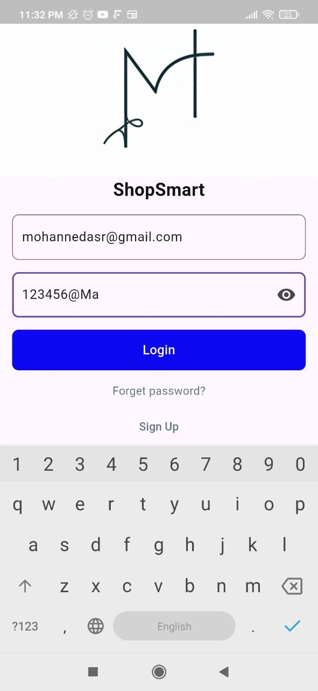
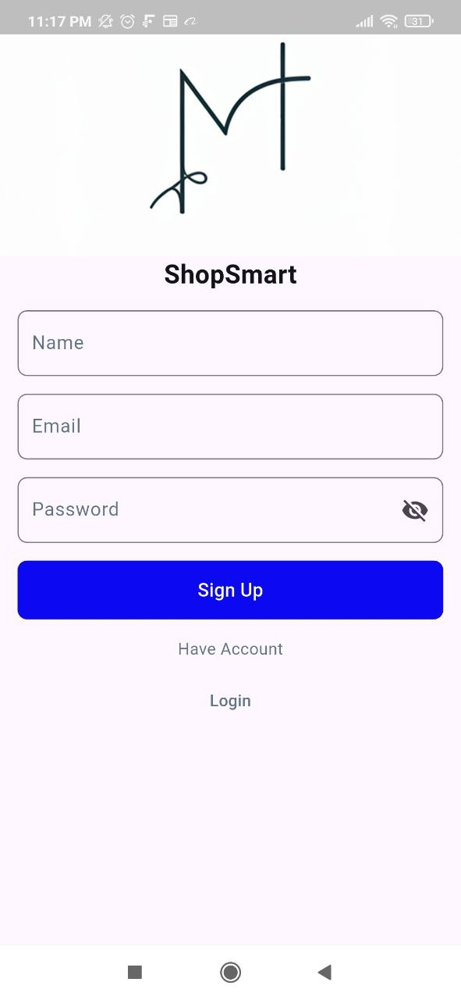
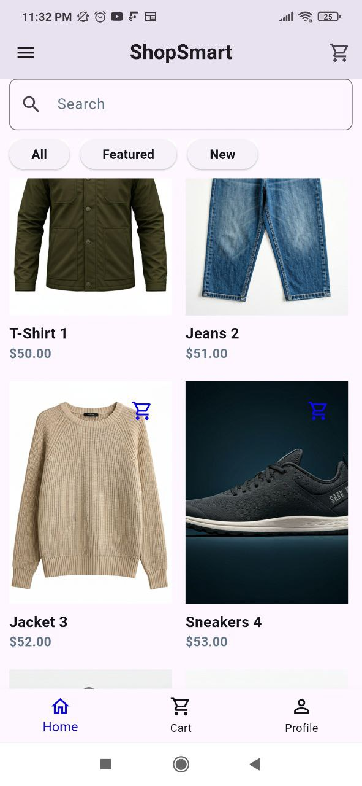
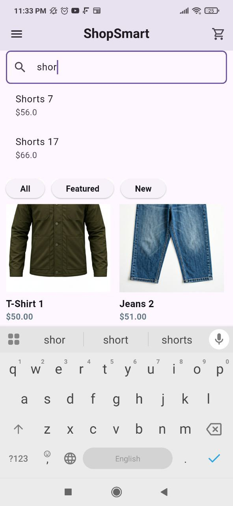
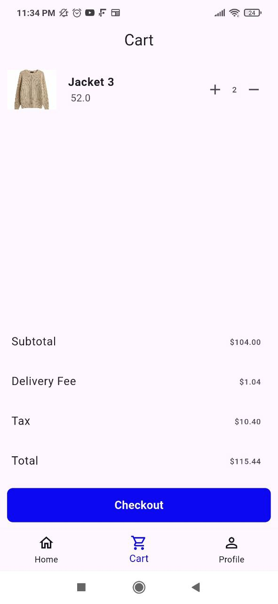
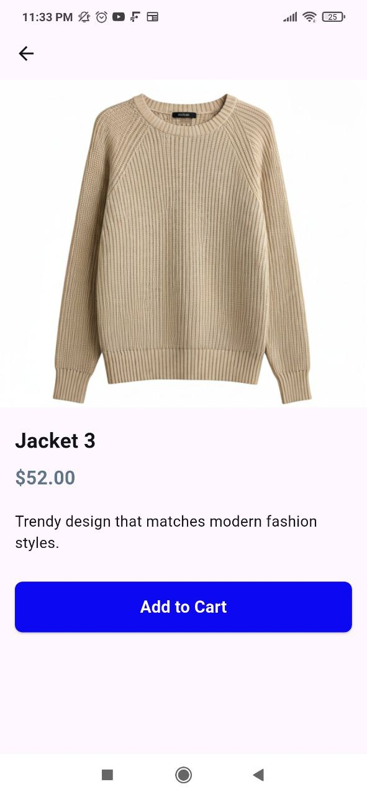

# 🛍️ E-Commerce Clothing App

A complete **E-Commerce Clothing App** built with Flutter, designed for a clothing store.  
The app provides a smooth shopping experience with features like authentication, browsing products, searching, cart management, checkout, and user profile.

---

## 📽️ Demo Video

---

## ✨ Features
- 🔐 **Authentication**: Login & Sign Up with email and password.  
- 🏠 **Home Page**: Explore available clothing products.  
- 🔎 **Search**: Find products quickly and easily.  
- 🛒 **Cart**: Add, remove, and manage items.  
- 💳 **Payment**: Checkout process with payment option.  
- 👤 **Profile**: Manage account information.  
- 👕 **Product Details**: View detailed product information.  

---

## 🖼️ Screenshots

### 🔐 Authentication

  
  

### 🏠 Home & 🔎 Search

  
  

### 🛒 Cart & 👕 Product Details

  
  

### 👤 Profile

  

